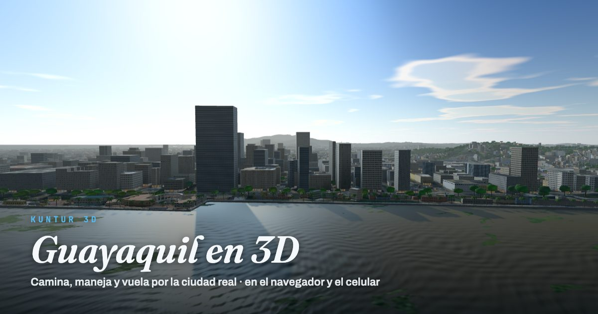

# Kuntur 3D

[](https://github.com/Javiervinus/kuntur3d/actions/workflows/ci.yml)
[](LICENSE)

**Ciudades reales en 3D, en el navegador, hechas con datos abiertos.** La primera es
Guayaquil, con Samborondón y Durán.

**[Abrir Kuntur 3D →](https://kuntur3d.javiervinueza.workers.dev)**



## Qué es

Kuntur 3D es una reconstrucción explorable de una ciudad real. Se recorre a pie, en carro o
planeando en ala delta, de día o de noche, en el computador o en el celular. Se inspira en
[San Francisco: The Game](https://sf.thijs.gg/), pero no parte de una malla fotogramétrica: no
existe una de Ecuador. La ciudad se arma entera con datos abiertos.

Lo distinguen dos cosas:

- **La escala.** Cubre el área urbana completa: Guayaquil, de Pascuales y Monte Sinaí al Guasmo,
  con el Suburbio y la Isla Trinitaria, más Samborondón y Durán. Son unos 28 × 26 km y ~540 mil
  edificios, cada uno en su huella y con su altura, sobre el relieve y la foto satelital
  reales. Se llega a cualquier calle, esquina o negocio.
- **La fidelidad de los lugares emblemáticos.** Los lugares que la gente reconoce se modelan uno
  por uno, con sus medidas reales, y se comparan con fotos tomadas desde el mismo punto:
  - el Palacio Municipal con el Pasaje Arosemena;
  - la Av. 9 de Octubre, del Malecón al Parque Centenario;
  - la iglesia de San Francisco;
  - la Columna de los Próceres;
  - la avenida principal de la Alborada;
  - The Point, la torre que gira en Puerto Santa Ana;
  - los centros comerciales Mall del Sol, San Marino, CityMall y Paseo Shopping Durán;
  - La Perla, la Torre Morisca, La Rotonda y el faro del cerro Santa Ana.

El resto de la ciudad (barrios, casas, fachadas comunes) se genera a partir de los datos. Se ve
correcta en conjunto y más genérica de cerca, y mejora a medida que se modelan más lugares.

## Características

- **Recorrido libre**: caminar, correr, trepar cualquier edificio, nadar y planear.
- **Carro** con física de vehículo: tracción, transferencia de peso, ABS, control de
  estabilidad y derrapes. Vista desde el asiento.
- **Buscador** de calles, esquinas, barrios y negocios, con un índice propio (y Nominatim para
  direcciones con número). También acepta links de Google y Apple Maps, Plus Codes y
  coordenadas.
- **Lugares con historia**: al llegar se abre su ficha, con foto, año, historia breve y fuentes
  verificadas.
- **Ciudad con vida**: tráfico por las calles reales según la hora, peatones en las veredas,
  autos estacionados y alumbrado público.
- **Día y noche**: mañana, mediodía, tarde y noche. De noche se encienden el alumbrado, las
  ventanas y los letreros, que se reflejan en el río.
- **Mapa y minimapa** dibujados en el navegador, con teletransporte y links para compartir un
  punto exacto.
- **Rendimiento**: 60 fps estables como meta en equipos modestos, con resolución adaptativa y
  carga por partes.

## Controles

| Tecla | Acción |
|---|---|
| W A S D | Caminar (W contra un muro: trepar) |
| Shift | Correr |
| Espacio | Saltar / soltarse del muro |
| H | Abrir o cerrar el ala delta |
| F | Subir o bajar del carro |
| C | Primera o tercera persona |
| − / + | Velocidad |
| T | Hora siguiente |
| M | Mapa |
| Esc | Pausa y menú |

En pantallas táctiles aparecen un joystick y botones. La lista completa está en el menú de
pausa → CONTROLES y en [docs/explorar.md](docs/explorar.md).

## Instalación

Requisitos: [Node.js](https://nodejs.org/) (la versión de `package.json`) y
[uv](https://docs.astral.sh/uv/) para el pipeline de datos en Python.

```bash
npm install
npm run data   # descarga y procesa los datos del mundo (~15 min la primera vez)
npm run dev    # http://localhost:5173
```

`npm run data` genera ~190 MB en `public/world/` y guarda sus descargas en `pipeline/.cache/`.
Los datos del mundo no se versionan. Los pasos del pipeline están descritos en
[docs/como-funciona.md](docs/como-funciona.md#pipeline-de-datos).

Otra zona se configura en `config/region.json` (`bbox`, `projection`, `landmarks`), volviendo a
correr `npm run data`.

## Documentación

| Documento | Contenido |
|---|---|
| [docs/explorar.md](docs/explorar.md) | Controles, personaje, carro, buscador, fichas de lugares, HUD y mapa |
| [docs/como-funciona.md](docs/como-funciona.md) | Fuentes de datos, pipeline y cómo se construye cada capa de la ciudad; carga por partes y rendimiento |
| [docs/lugares.md](docs/lugares.md) | Los lugares modelados con detalle y cómo se modela uno nuevo |
| [docs/publicar.md](docs/publicar.md) | Despliegue en Cloudflare Workers |
| [CONTRIBUTING.md](CONTRIBUTING.md) | Cómo reportar, pedir una ciudad o aportar código |

## Arquitectura

- **Cliente**: TypeScript, [Three.js](https://threejs.org/) y Vite. Todo corre en el navegador,
  con web workers para la geometría, las calles y la imagen satelital.
- **Pipeline de datos**: Python (`pipeline/build_world.py`). Descarga las fuentes abiertas y las
  procesa por partes de 500 m.
- **Configuración**: todos los parámetros están en `config/*.json`. El código no tiene valores
  fijos.
- **Publicación**: archivos estáticos y un Worker de Cloudflare.

| Capa | Fuente |
|---|---|
| Suelo | Esri World Imagery |
| Relieve | Copernicus DEM GLO-30 |
| Edificios | Overture Maps y Google Open Buildings 2.5D |
| Calles, parques, puentes y alumbrado | OpenStreetMap |
| Árboles | Meta y WRI, High Resolution Canopy Height Maps v2 |
| Agua | Overture Maps |
| Negocios | Overture Places y OpenStreetMap |
| Fotos de las fichas | Wikimedia Commons |

```
config/          región, parámetros de la app, modelos, fichas y lugares modelados (calles, sitios, casas)
pipeline/        generación de los datos del mundo (public/world/)
src/world/       terreno, edificios, calles, agua, árboles, puentes, íconos, tráfico y peatones
src/player/      personaje, controlador, cámara y ala delta
src/vehicles/    carro
src/ui/          HUD, buscador, mapa, pausa y fichas
src/render/      cielo, materiales, calidad adaptativa y precompilación de shaders
server/          links cortos de mapas y proxy de imagen (desarrollo y Worker)
.agents/skills/  procedimientos para agentes (modelar un lugar)
```

## Contribuir

Se puede aportar sin programar: reportar un edificio que está mal, pedir otra ciudad o sumar
fotos de un lugar. Para modelar un lugar con detalle (un monumento, una calle o una casa a partir
de fotos) hay un procedimiento para agentes en
[`.agents/skills/model-place`](.agents/skills/model-place/SKILL.md). Todo el detalle está en
[CONTRIBUTING.md](CONTRIBUTING.md).

## Hoja de ruta

- Más lugares modelados: la Gobernación, la Biblioteca y el Museo Municipal, Correos, la
  Catedral y la Av. 9 de Octubre hasta la Av. Quito.
- La Metrovía por sus troncales, con sus paradas.
- Semáforos en los cruces y choques con el tráfico.
- Vendedores ambulantes y gente sentada en el Malecón.
- Más rendimiento: imagen satelital comprimida en GPU y migración a WebGPU.
- Multijugador.

## Licencia

- **Código**: [AGPL-3.0 o posterior](LICENSE), con términos adicionales de atribución: toda
  versión debe mostrar "Kuntur 3D, creado por Javier Vinueza" en sus créditos, y las versiones
  modificadas deben identificarse como tales. Ver [NOTICE.md](NOTICE.md).
- **Contenido propio** (textos de las fichas y material original): CC BY-SA 4.0.
- **Imagen satelital de Esri**: uso no comercial con atribución. Una publicación comercial
  requiere cambiar la fuente (`imagery.urlTemplate`).

## Créditos

Creado por Javier Vinueza.

- © Colaboradores de [OpenStreetMap](https://www.openstreetmap.org/copyright) (ODbL).
- Edificios: Overture Maps Foundation (OpenStreetMap, Google Open Buildings, Microsoft).
- Alturas: Google Open Buildings 2.5D Temporal (CC BY 4.0).
- Árboles: Meta y World Resources Institute, High Resolution Canopy Height Maps v2 (CC BY 4.0).
- Relieve: Copernicus DEM GLO-30 © DLR e.V. 2010-2014 y © Airbus Defence and Space GmbH
  2014-2018, provisto bajo COPERNICUS por la Unión Europea y la ESA.
- Imagen satelital: Esri, Maxar, Earthstar Geographics.
- Personajes: Universal Base Characters y Universal Animation Library de Quaternius (CC0).
- Fotos de las fichas: autores de Wikimedia Commons, con licencias libres (CC BY-SA o CC BY); cada
  ficha muestra el autor y la licencia.

La app muestra los créditos completos en el menú de pausa → CRÉDITOS.
